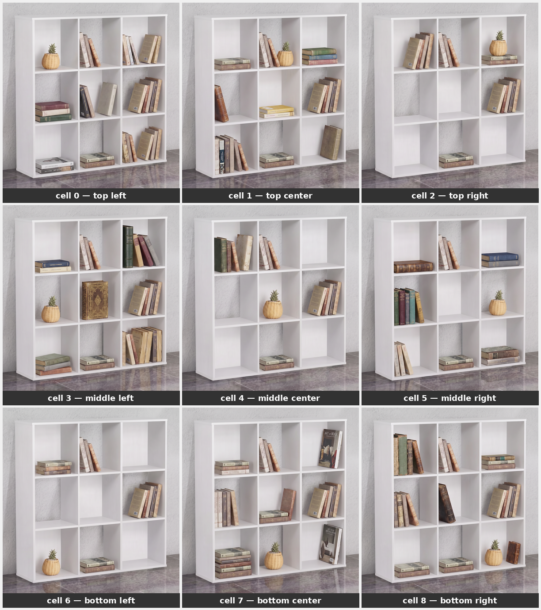

# Pineapple Cup Detection — POC

Detects a pineapple cup on a 3×3 bookshelf and tells you **which shelf cell** it is in.



---

## What does this system do?

You give it a photo of the shelf. It tells you:

```json
{ "has_cup": 1, "cell_id": 4 }
```

| Field | Meaning |
|---|---|
| `has_cup` | `1` = cup is present, `0` = no cup |
| `cell_id` | Which cell (0–8), or `null` if no cup |

The 9 cells are numbered like this:

```
| 0 | 1 | 2 |
| 3 | 4 | 5 |
| 6 | 7 | 8 |
```

---

## How it works — high level

| Step | What happens | Who does it |
|---|---|---|
| 1. Take photos | Photograph the shelf with the cup in each of 9 positions, plus one photo with no cup | You |
| 2. Draw bounding boxes | Open Label Studio, draw a box around the cup in each photo | You |
| 3. Augment | The computer generates ~260 training images from your 10 photos | Script |
| 4. Train | A small AI model (YOLOv8) learns what the cup looks like | Script |
| 5. Detect | Give the model a new photo — it finds the cup and returns the cell number | Script |

---

## First-time setup

### Requirements
- Python 3.10–3.13
- [uv](https://docs.astral.sh/uv/getting-started/installation/) installed

### Install dependencies

```bash
uv sync
```

---

## Quick start — skip training

If you don't want to train the model yourself, download the pre-trained weights from Google Drive:

**[Download best.pt](https://drive.google.com/file/d/1IgDuacHHGZzuF_43mvtDdCblUHWHnUPa/view?usp=drive_link)**

Place the downloaded file in the **project root** as `best.pt`, then open the notebook:

```bash
uv run jupyter lab walkthrough.ipynb
```

---

## Step-by-step guide

### Step 1 — Label your images

Start Label Studio (the annotation tool):

```bash
uv run label-studio
```

Then open your browser at **http://localhost:8080** and follow these steps:

| # | Action |
|---|---|
| 1 | Click **Create Project** → name it `pineapple_cup` |
| 2 | Go to **Labeling Setup** → choose **Object Detection with Bounding Boxes** |
| 3 | Delete default labels, add one label: `pineapple_cup` → **Save** |
| 4 | Go to **Data Import** → drag all 10 images from `sample_data/` → **Import** |
| 5 | Click **Label All Tasks** → draw a box around the cup in each image |
| 6 | For `missing.png` (no cup) — click **Submit** without drawing any box |
| 7 | Go to **Export** → choose **YOLO** format → download the zip |
| 8 | Unzip it and copy the `labels/` folder into this project as `annotations/` |

### Step 2 — Verify your annotations look correct

```bash
uv run python src/annotate.py --src_images sample_data/ --src_labels annotations/ --out_dir annotation_preview/ --no_show
```

Open the `annotation_preview/` folder and check that every image has a green box on the cup.

---

### Step 3 — Generate training data

```bash
uv run python src/augment.py --src_images sample_data/ --src_labels annotations/ --out_dir dataset/ --n_aug 25
```

This creates ~260 training images from your 10 originals by varying brightness, blur, and colour.

---

### Step 4 — Train the model

```bash
uv run python src/train.py
```

This takes about **10–30 minutes** on CPU. When finished, the best model is saved to:

```
runs/train/pineapple_cup_v1/weights/best.pt
```

---

### Step 5 — Test on a single image

```bash
uv run python src/detect.py --weights runs/train/pineapple_cup_v1/weights/best.pt \
                            --image sample_data/top_left.png --viz
```

This prints the result and saves an annotated image called `top_left_result.png`.

---

### Step 6 — Evaluate on all 10 sample images

```bash
uv run python src/evaluate.py --weights runs/train/pineapple_cup_v1/weights/best.pt --save_viz
```

Expected output:

```
Image                  GT                   Pred                 Presence    Cell
--------------------------------------------------------------------------------
top_left               has=1 cell=0         has=1 cell=0            ✓          ✓
top_center             has=1 cell=1         has=1 cell=1            ✓          ✓
...
missing                has=0 cell=None      has=0 cell=None         ✓         N/A
--------------------------------------------------------------------------------
Presence accuracy : 10/10 (100.0%)
Cell accuracy     : 9/9   (100.0%)
```

---

## Project files

| File | What it does |
|---|---|
| `src/annotate.py` | Draws bounding boxes on images so you can verify annotations visually |
| `src/augment.py` | Creates extra training images from your 10 originals |
| `src/train.py` | Trains the YOLOv8 detection model |
| `src/detect.py` | Runs the trained model on a single image and returns a result |
| `src/evaluate.py` | Tests the model against all 10 known sample images |
| `dataset.yaml` | Tells the training script where the data is and what classes exist |
| `sample_data/` | The 10 reference photos (9 with cup + 1 without) |
| `annotations/` | Bounding box labels you export from Label Studio *(you create this)* |
| `dataset/` | Augmented training images *(generated by src/augment.py)* |
| `runs/` | Training results and saved model weights *(generated by src/train.py)* |
